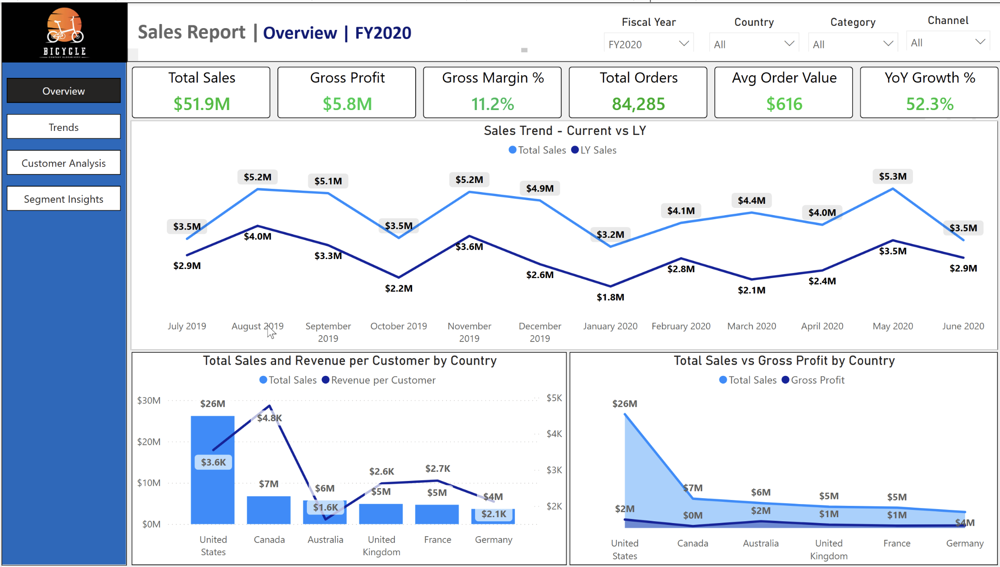
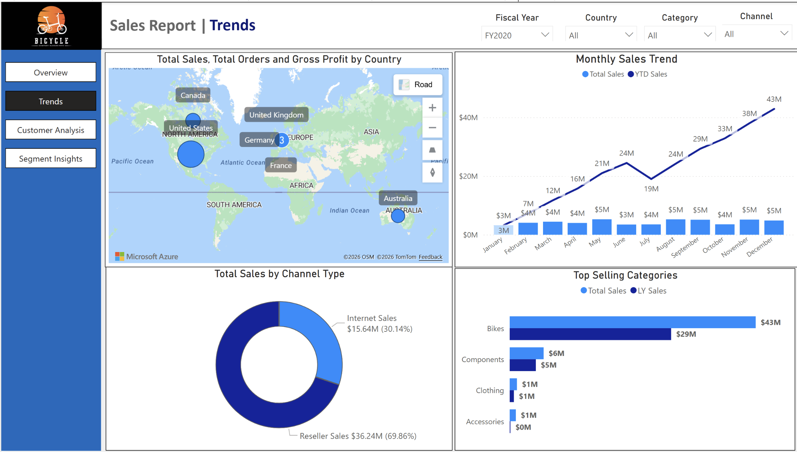
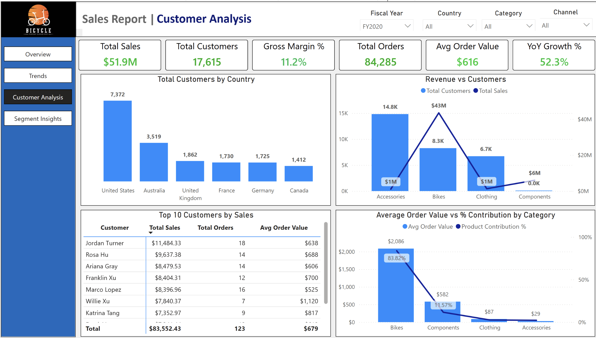
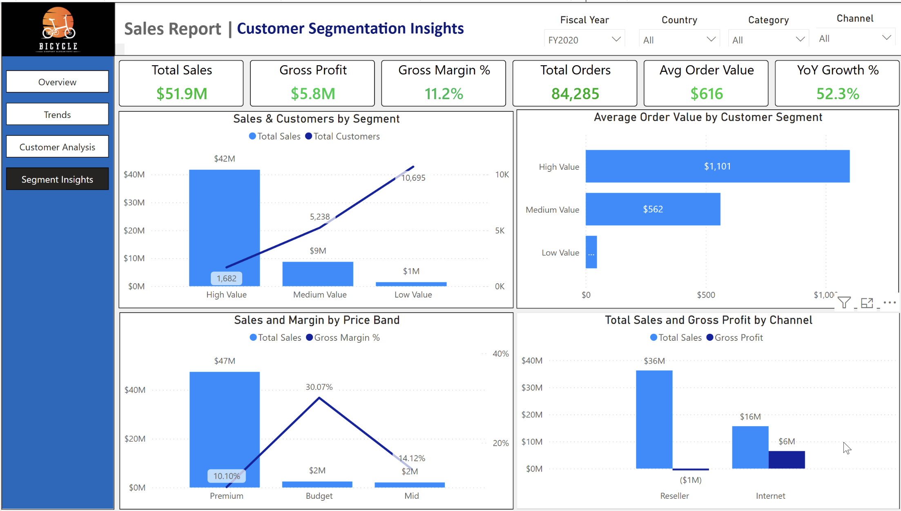
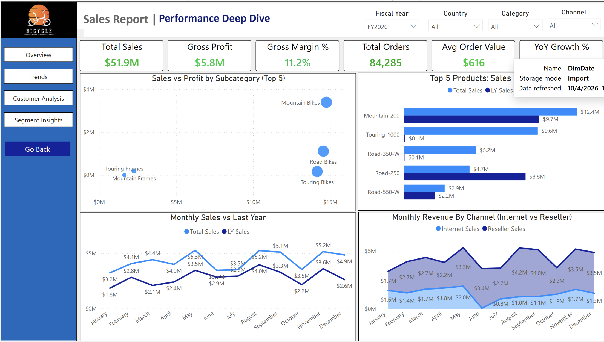
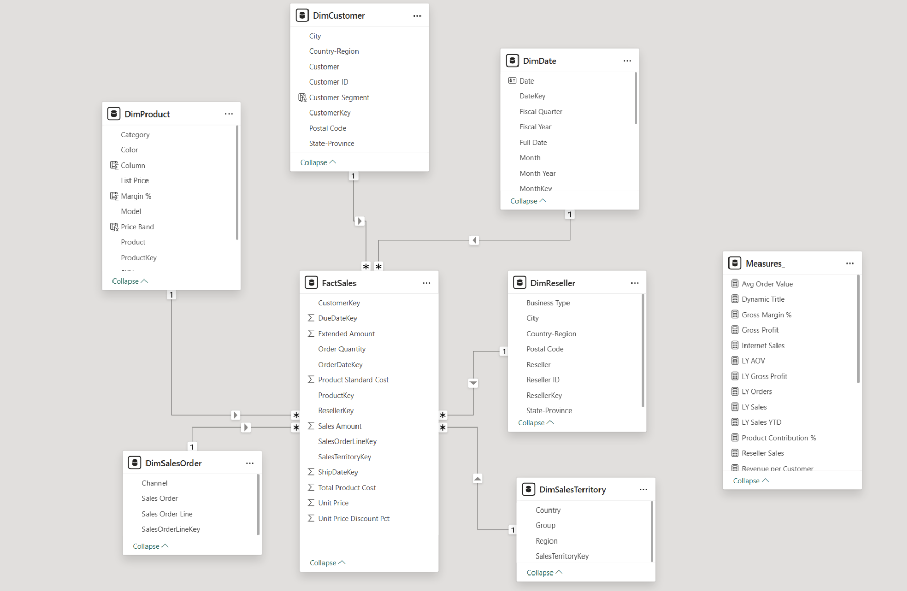

# AdventureWorks Sales Report — Power BI

A **production-style, multi-page Sales Analytics report** built entirely in Power BI Desktop on the AdventureWorks Sales dataset. This project demonstrates end-to-end BI development right from refining raw Excel source to a structured star schema, building a reusable DAX measure library, enabling a cross-page drill-through, using dynamic titles, and showcsaing Row-Level Security.

---

## Dashboard Pages

### Overview
> Executive summary — KPI cards, 12-month sales trend vs prior year, country-level revenue and profitability breakdown.



---

### Trends
> Geographic sales distribution, channel mix (Internet vs Reseller), YTD cumulative growth, and category-level comparisons.



---

### Customer Analysis
> Customer geography, revenue concentration by category, top 10 customers by total sales, and AOV contribution analysis.



---

### Segment Insights
> Customer segmentation (High / Medium / Low Value), price band margin analysis, and channel-level profitability.



---

### Performance Deep Dive
> Subcategory-level scatter analysis (Sales vs Profit), top 5 products with LY comparison, and monthly channel revenue breakdown.




---

##  Data Model

A clean **Star Schema** — one central fact table joined to six dimension tables, with an isolated `Measures_` table holding all DAX logic.



```
FactSales  (centre)
├── DimCustomer        → CustomerKey
├── DimProduct         → ProductKey
├── DimDate            → DueDateKey / OrderDateKey / ShipDateKey
├── DimReseller        → ResellerKey
├── DimSalesTerritory  → SalesTerritoryKey
└── DimSalesOrder      → SalesOrderLineKey 

Measures_             (isolated — no relationships, no columns)
```

---

## DAX Measures

All 23 measures are organised into logical groups within the `Measures_` table.

### Core Sales
| Measure | Logic Summary |
|---------|--------------|
| `Total Sales` | `SUM(FactSales[Sales Amount])` |
| `Total Orders` | `DISTINCTCOUNT(FactSales[SalesOrderLineKey])` |
| `Total Customers` | `DISTINCTCOUNT(FactSales[CustomerKey])` |
| `Total Cost` | `SUM(FactSales[Total Product Cost])` |
| `Total Customer Sales` | `CALCULATE([Total Sales],ALLEXCEPT(DimCustomer, DimCustomer[CustomerKey]))` |
| `Avg Order Value` | `DIVIDE([Total Sales], [Total Orders])` |
| `Revenue per Customer` | `DIVIDE([Total Sales],[Total Customers])` |

### Profitability
| Measure | Logic Summary |
|---------|--------------|
| `Gross Profit` | `[Total Sales] - [Total Cost]` |
| `Gross Margin %` | `DIVIDE([Gross Profit], [Total Sales])` |
| `Product Contribution %` | Product sales as % of ALL sales using `ALLSELECTED` |

### Channel
| Measure | Logic Summary |
|---------|--------------|
| `Internet Sales` | `CALCULATE([Total Sales], DimSalesOrder[Channel] = "Internet")` |
| `Reseller Sales` | `CALCULATE([Total Sales], DimSalesOrder[Channel] = "Reseller")` |

### Time Intelligence
| Measure | Logic Summary |
|---------|--------------|
| `LY Sales` | `CALCULATE([Total Sales], SAMEPERIODLASTYEAR(DimDate[Date]))` |
| `LY Sales YTD` | Prior year YTD using `CALCULATE( [YTD Sales], SAMEPERIODLASTYEAR(DimDate[Date]))` |
| `LY Gross Profit` | Prior year gross profit |
| `LY Orders` | Prior year order count |
| `LY AOV` | Prior year average order value |
| `YTD Sales` | `TOTALYTD([Total Sales], DimDate[Date])` |
| `YoY Growth %` | `DIVIDE([Total Sales] - [LY Sales], [LY Sales])` |
| `YoY Sales %` | Variant for specific visual formatting `Var YoY_Sales = [Total Sales]-[LY Sales] Return DIVIDE(YoY_Sales,[LY Sales])` |
| `YoY Orders %` | Year-over-year change in order volume `Var YoY_Orders = [Total Orders]-[LY Orders] Return DIVIDE(YoY_Orders,[LY Orders])`|

### Supporting
| Measure | Logic Summary |
|---------|--------------|
| `Top Product Rank` | `RANKX(ALL(DimProduct[Product]), [Total Sales],DESC)` — drives Top N filtering |
| `Dynamic Title` | `SELECTEDVALUE` pattern — titles update based on active slicer context |

---

## Row-Level Security (RLS)

To demonstrate static RLS, attribute `Region_access` security role is implemented on the **DimSalesTerritory** table:

```
DimSalesTerritory[Country] = "United States"
```


When a user is assigned this role, the entire report is statically filtered to US data only — all visuals, KPIs, and drill-throughs respect the filter automatically via the model's relationships.

**Why this matters:** RLS is a governance requirement in any real enterprise deployment. Even this static implementation demonstrates understanding of how Power BI security propagates through a relational model — the filter on DimSalesTerritory flows through FactSales to every connected dimension without any per-visual configuration.

---

## Report Features

| Feature | Implementation |
|---------|---------------|
| **Cross-page drill-through** | Deep Dive page — right-click any product/subcategory to drill through |
| **Dynamic titles** | Page titles update based on active slicer selection via `SELECTEDVALUE` DAX |
| **Tooltip page** | Custom hover tooltip for enriched context on visuals |
| **Consistent slicers** | Fiscal Year, Country, Category, Channel — synced across all pages |
| **LY comparisons** | Every key metric has a prior-year counterpart for immediate variance context |
| **Dual-axis visuals** | Bar + line combos used throughout for volume vs rate metrics |
| **Row-Level Security** | `Region_access` role restricts data at model level, not visual level |

---

## Dataset

**Source:** [AdventureWorks Sales — Microsoft Power BI Desktop Samples](https://github.com/microsoft/powerbi-desktop-samples/tree/main/AdventureWorks%20Sales%20Sample)

A single Excel workbook with pre-structured Dimension and Fact tables. Download the file, open the `.pbix`, update the data source path via **Transform Data → Data Source Settings**, and refresh — all relationships, measures, and RLS roles load automatically.


## Author

**Ashish Mohan**
Senior Data Analyst & BI Specialist | Power BI PL-300 Certified | Tableau Certified Analyst

[LinkedIn](https://www.linkedin.com/in/YOUR_PROFILE) · [GitHub](https://github.com/YOUR_USERNAME)

---

*Built on the AdventureWorks Sales dataset provided by Microsoft under open license for training and demonstration purposes.*
